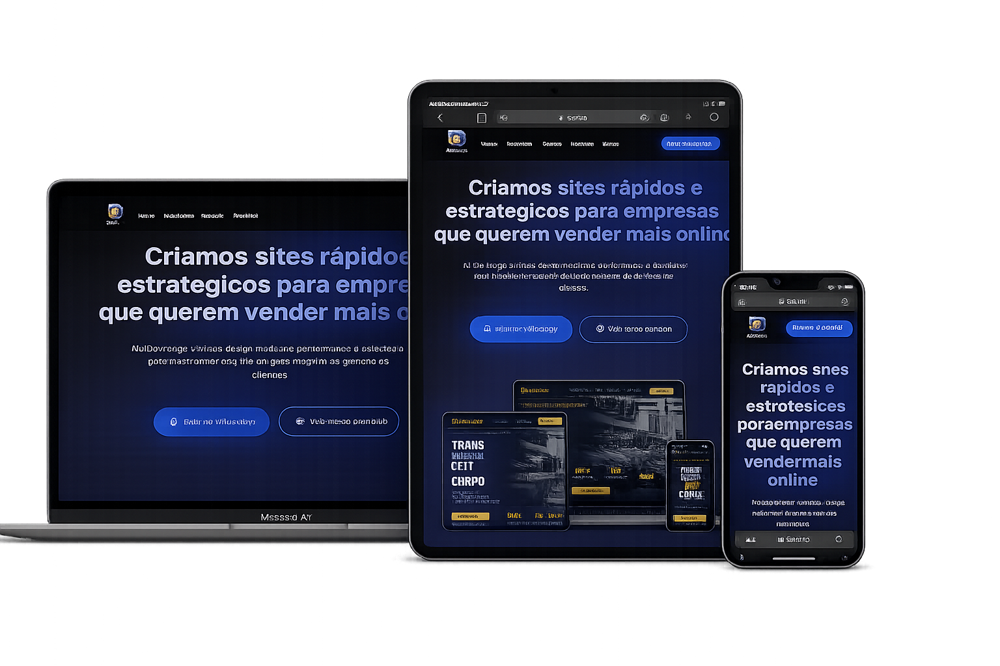

# 🚀 DevForge — Portfólio Profissional

Landing page institucional desenvolvida para apresentar os projetos, serviços e capacidades da DevForge, com foco em conversão de clientes e posicionamento no mercado digital.

---

## 📌 Visão Geral

Este projeto representa o portfólio oficial da DevForge, criado para demonstrar, na prática, a qualidade técnica, o padrão visual e a estratégia aplicada no desenvolvimento de sites profissionais.

Mais do que um site, é um ativo comercial utilizado para:

- Atrair novos clientes
- Validar autoridade
- Demonstrar projetos reais
- Converter visitantes em leads

---

## 🎯 Objetivo

- Posicionar a DevForge como solução profissional em desenvolvimento web
- Apresentar projetos de forma estratégica (não apenas estética)
- Gerar contatos qualificados
- Servir como vitrine comercial para aquisição de clientes

---

## 🧠 Estrutura da Landing Page

A página foi estruturada com base em princípios de copywriting e conversão:

- Hero Section → Proposta de valor clara e direta
- Problema → Identificação das dores do cliente
- Solução → Apresentação dos diferenciais da DevForge
- Portfólio → Projetos desenvolvidos (prova prática)
- Processo → Como o serviço é executado
- Prova Social → Depoimentos
- Oferta → Benefícios e diferenciais
- CTA Final → Conversão (orçamento / contato)

---

## 🛠️ Tecnologias Utilizadas

- HTML5 → Estrutura semântica
- CSS3 → Design moderno, responsivo e animado
- JavaScript → Interações e efeitos dinâmicos

---

## ⚙️ Funcionalidades

- Navegação suave entre seções
- Animações ao scroll (Intersection Observer)
- Design responsivo (mobile-first)
- Botões de contato direto (WhatsApp / Orçamento)
- Estrutura otimizada para conversão
- UI moderna com glassmorphism e gradientes

---

## 📱 Responsividade

Totalmente adaptado para:

- Smartphones
- Tablets
- Desktops

---

## 📸 Preview

---

## 🔗 Deploy

Acesse o projeto online:

https://devforgeweb.netlify.app/

---

## 📈 Estratégia Aplicada

Este projeto não foi desenvolvido apenas como portfólio visual, mas como ferramenta de aquisição de clientes:

- Copywriting orientado à conversão
- Estrutura baseada em funil (AIDA)
- Prova social para aumento de confiança
- CTAs distribuídos estrategicamente
- Foco em performance e carregamento rápido

---

## 💼 Nichos Atendidos

A DevForge desenvolve sites para diferentes segmentos, como:

- Escritórios jurídicos
- Clínicas de saúde e odontologia
- Academias
- Salões de beleza
- Clínicas de estética
- Construtoras
- Escolas
- concessionárias
- Negócios locais

---

## 🔧 Melhorias Futuras

- Integração com CRM
- Dashboard de leads
- Sistema de captação com formulários avançados
- SEO técnico avançado
- Testes A/B para otimização de conversão

---

## 👨‍💻 Desenvolvido por

DevForge

🌐 Site: https://devforgeweb.netlify.app/
 
💬 WhatsApp: https://wa.me/5585997013067

---

## 📄 Licença

Este projeto está sob a licença MIT.